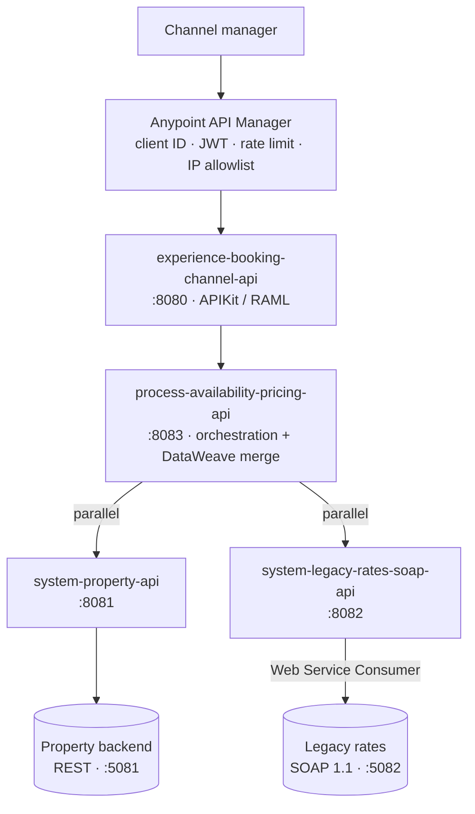

# MuleSoft API-led property integration

A three-layer API-led integration on Mule 4: a channel-manager Experience API in
front of a Process API that merges availability with pricing, over two System
APIs that wrap a REST inventory backend and a legacy SOAP rates engine.

**This is a portfolio project, not a production system.** It is real, runnable
code with real tests, but it runs against mock backends, uses a static FX table,
and its MUnit suites have not yet been executed — see
[Honest status](#honest-status) before you judge anything by it.

---

## Why it exists

The interesting problem in booking integrations is not calling two APIs. It is
that *availability* and *price* live in different systems, disagree about dates,
disagree about currency, and both have to be right before you can sell a night.
This repo is that problem, solved with the API-led pattern:

- one **System API** per system of record, absorbing its dialect
- one **Process API** owning the business rule that joins them
- one **Experience API** per consumer, owning only that consumer's vocabulary

## Architecture



Full diagrams, the layer contract and the cross-cutting concerns:
[docs/architecture.md](docs/architecture.md).
A single request traced end to end, plus two failure paths:
[docs/sequence.md](docs/sequence.md).

## Repository layout

```
system-property-api/                 System API over the REST inventory backend
system-legacy-rates-soap-api/        System API over the SOAP rates engine (WSC)
process-availability-pricing-api/    Orchestration, the merge, the rates cache
experience-booking-channel-api/      APIKit-routed API for the channel manager
  api-spec/openapi.yaml              OpenAPI 3.0 contract (Exchange + contract tests)
  src/main/resources/api/*.raml      RAML APIKit routes against at runtime
mocks/property-backend/              .NET 8 minimal API, REST, with fault injection
mocks/legacy-rates-soap/             .NET 8 SOAP 1.1 mock + the WSDL
scripts/                             run-mocks.sh · run-tests.sh · contract_tests.py
docs/                                architecture · sequence · policies · setup · troubleshooting
```

## How to run

Requires JDK 17/21, Maven 3.8+, Anypoint Studio 7.17+, the .NET 8 SDK and
Python 3.10+. Full walkthrough in [docs/setup.md](docs/setup.md).

```bash
# 1. Local configuration (config-dev.yaml is gitignored by design)
for m in system-property-api system-legacy-rates-soap-api \
         process-availability-pricing-api experience-booking-channel-api; do
  cp "$m/src/main/resources/config-example.yaml" "$m/src/main/resources/config-dev.yaml"
done

# 2. Mock backends
scripts/run-mocks.sh start          # :5081 REST, :5082 SOAP

# 3. The four Mule apps, from Anypoint Studio (Run As > Mule Application)
#    8081 system-property  ·  8082 system-rates  ·  8083 process  ·  8080 experience

# 4. Ask it something
curl -s "http://localhost:8080/channel/v1/properties?city=Valencia" | jq
curl -s "http://localhost:8080/channel/v1/properties/PROP-1001/quote\
?checkIn=2026-06-01&checkOut=2026-06-05&guests=2&currency=EUR" | jq
```

The mocks inject faults on demand, which is how the retry and error paths were
designed to be exercised:

```bash
curl "http://localhost:5081/backend/v1/properties?fail=500"      # backend 500
curl "http://localhost:5081/backend/v1/properties?fail=timeout"  # 30s stall
```

## How to test

| Layer | Command | What it covers |
|---|---|---|
| Transformation | `scripts/run-tests.sh process-availability-pricing-api` | 8 MUnit tests over the merge: totals, FX rounding, occupancy surcharge, closed vs unpriced nights, month grouping |
| Orchestration | `scripts/run-tests.sh` | 4 MUnit tests over the error paths: 404 pass-through, timeout propagation, cache hit skips the downstream call, cache miss stores |
| Contract | `python scripts/contract_tests.py` | 20+ live checks of a running Experience API against `openapi.yaml`, including totals arithmetic and correlation-id round-trip |
| Mocks | `dotnet build mocks/**/*.csproj` | Both backends compile and serve |

The contract tests also run against the managed endpoint once API Manager is in
front of it:

```bash
python scripts/contract_tests.py \
  --base-url https://<your-api>.eu1.anypoint.mulesoft.com/channel/v1 \
  --client-id "$CLIENT_ID" --client-secret "$CLIENT_SECRET"
```

CI runs everything that needs no credentials on every push, and reports the MUnit
job as *skipped with a reason* rather than failing when Anypoint secrets are
absent: [.github/workflows/build.yml](.github/workflows/build.yml).

## What this demonstrates

| Skill | Where to look |
|---|---|
| **API-led connectivity** | Four modules, one per layer. The layer contract and the substitution test that keeps it honest: [docs/architecture.md](docs/architecture.md#why-each-layer-exists) |
| **DataWeave transformation** | [`merge-availability-pricing.dwl`](process-availability-pricing-api/src/main/resources/dwl/merge-availability-pricing.dwl) — date join, `groupBy` month blocks, FX with a null-safe fallback, occupancy surcharge, rounding once. Plus [`FxRates.dwl`](process-availability-pricing-api/src/main/resources/modules/FxRates.dwl) as a reusable module, and four more scripts across the system and experience layers |
| **API gateway policies** | [docs/api-manager-policies.md](docs/api-manager-policies.md) — exact settings for JWT validation, SLA rate limiting, IP allowlist, header injection and URL rewrite, plus why the order is what it is |
| **Products, subscriptions, revisions** | [docs/api-manager-policies.md](docs/api-manager-policies.md#products-subscriptions-versions-and-revisions) — Starter/Premium products, SLA tiers, and the version-vs-revision rule of thumb |
| **Caching and performance** | Object Store rates cache with TTL, and a deliberate decision *not* to cache availability: [`process-availability-pricing-api.xml`](process-availability-pricing-api/src/main/mule/process-availability-pricing-api.xml). Scatter-gather makes the two system calls parallel |
| **SOAP / legacy integration** | Web Service Consumer over a packaged WSDL, minor-unit amounts, empty-element handling, SOAP faults mapped to 422: [`rates-to-canonical.dwl`](system-legacy-rates-soap-api/src/main/resources/dwl/rates-to-canonical.dwl) |
| **Error handling and resilience** | A shared error envelope in every layer, nested `until-successful` backoff, and 404s excluded from retry: [docs/sequence.md](docs/sequence.md#failure-path-the-rates-backend-is-down) |
| **Secret management** | `.gitignore`d real config, `config-example.yaml` placeholders, `secureProperties` in `mule-artifact.json`, and the full secure-properties-tool procedure in [docs/setup.md](docs/setup.md#secret-management) |
| **Automation with Python** | [`scripts/contract_tests.py`](scripts/contract_tests.py) — converts the OAS 3.0 dialect to JSON Schema and validates every live response against the published contract |
| **Integration testing and troubleshooting** | 12 MUnit tests, the contract suite, fault injection in the mocks, and [docs/troubleshooting.md](docs/troubleshooting.md) |
| **Technical documentation** | This README, five documents under `docs/`, and comments in the code that explain *why* rather than restating *what* |

> PowerShell automation and queue-based integration are demonstrated in the
> sibling repository, `azure-apim-secure-gateway-messaging`.

## Honest status

**Verified by running it:**

- Both mock backends build and serve. The property backend filters by city,
  returns 404 for an unknown property, and produces a day-by-day calendar; the
  SOAP mock returns a well-formed `GetRatesResponse` and a SOAP 1.1 fault with
  HTTP 500.
- Every Mule XML, MUnit suite, WSDL and POM is well-formed (17 files).
- `contract_tests.py` compiles, and its OpenAPI-to-JSON-Schema conversion was
  checked against valid and deliberately invalid payloads.
- The API specifications are internally consistent.

**Written but not executed:**

- The 12 MUnit tests. Maven is not installed in the environment this was authored
  in, and the Mule runtime and MUnit plugins come from MuleSoft's credentialed
  repositories. Expected values were computed by hand from the fixtures and are
  documented in the suite header. Run `scripts/run-tests.sh` and fix anything
  that turns out to be off before relying on them.
- The API Manager policies. They are documented as exact settings, not applied —
  applying them needs an Anypoint organisation.

**Deliberately simplified:**

- Static FX table instead of a rates provider.
- Deterministic pseudo-random availability in the mock instead of real inventory.
- No persistence anywhere; the Object Store is in-memory.

## What I would change for production

1. **Autodiscovery, not trust.** Add `<api-gateway:autodiscovery>` to the
   Experience API so the app refuses to serve traffic that has not passed through
   its managed API instance. Without it, anyone who can reach the app's URL
   bypasses every policy.
2. **Persistent, clustered Object Store.** The rates cache is in-memory, so on
   CloudHub with two workers each worker has its own. Switch to
   `persistent="true"` (Object Store v2), and add a cache-busting key on rate
   plan updates rather than relying on TTL alone.
3. **A real FX service.** `FxRates.dwl` is a static table. Replace it with a rates
   provider behind its own System API, cached hourly, with a hard rule that a
   stale rate is never used to quote — it should fail closed, exactly as the
   unknown-currency path already does.
4. **Idempotency and a booking write path.** This repo is read-only. The moment
   bookings are written, the Process API needs an idempotency key, an outbox for
   the confirmation, and a reconciliation job — the pattern in the sibling
   repository.
5. **Circuit breaker, not just retry.** Nested `until-successful` handles a blip.
   A backend that is down for ten minutes needs a breaker so requests fail fast
   instead of each one waiting three seconds; Mule has no built-in breaker, so
   this means an Object Store-backed state machine or a custom module.
6. **Real observability.** JSON logs are the floor. Add Anypoint Monitoring
   custom metrics for cache hit rate, quote latency split by layer, and the
   unpriced-night rate — the last one is a business alarm, not a technical one.
7. **Contract tests in the pipeline, against a deployed environment.**
   `contract_tests.py` should run post-deploy against Sandbox and gate promotion.
8. **Secure properties enabled**, with the key injected from CloudHub properties
   or a CI secret, and every credential rotated on a schedule.

## Related

- Sibling repository: **`azure-apim-secure-gateway-messaging`** — the same
  booking domain behind Azure API Management, with Service Bus queue processing,
  Key Vault, and PowerShell automation.

## License

MIT — see [LICENSE](LICENSE).
