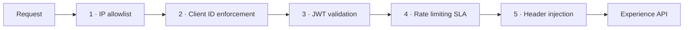

# API Manager policy configuration

> **Scope note.** Policies are applied in Anypoint API Manager, not in the
> application code, so this file is the source of truth for them. Everything
> below is written as exact settings you can retype into the console. Screenshot
> placeholders under `images/` mark where to drop your own captures once you have
> applied them on a trial organisation — **do not** trust a screenshot in a repo
> as evidence a policy is active; check the API instance's Policies tab.

## Policy order

Order matters, and the console applies policies in the order listed. This is the
order used here and why:



1. **IP allowlist first** — the cheapest possible rejection, before any parsing.
2. **Client ID enforcement** — establishes *who* is calling, which the SLA tier
   in step 4 depends on.
3. **JWT validation** — establishes that the caller is *authenticated*. After
   client ID, because an unknown client should be rejected before spending a
   signature verification.
4. **Rate limiting SLA** — needs the identity from steps 2–3 to pick a tier.
5. **Header injection** — only reached by requests that will actually be served.

---

## 1. IP allowlist

| Setting | Value |
|---|---|
| Policy | `IP allowlist` |
| IP expression | `#[attributes.headers['x-forwarded-for']]` |
| Allowed IPs | `203.0.113.0/24`, `198.51.100.14` (RFC 5737 placeholders — replace with the partner's egress ranges) |

Take the client IP from `x-forwarded-for` rather than the socket address:
CloudHub sits behind a load balancer, so the socket address is the balancer's.

---

## 2. Client ID enforcement

| Setting | Value |
|---|---|
| Policy | `Client ID enforcement` |
| Credentials origin | `Custom expression` |
| Client ID expression | `#[attributes.headers['client_id']]` |
| Client secret expression | `#[attributes.headers['client_secret']]` |

The API is not public, so this policy is what makes a subscription meaningful:
without an approved contract against a product, the request never reaches the app.

**Exclude `/health`** so uptime monitors do not need credentials. Add a resource
exclusion for method `GET`, path `/health`.

---

## 3. JWT validation

| Setting | Value |
|---|---|
| Policy | `JWT validation` |
| JWT origin | `HTTP Bearer authentication header` |
| Signing method | `RSA` |
| Signing key length | `256` |
| JWT key origin | `JWKS` |
| JWKS url | `https://login.microsoftonline.com/{tenantId}/discovery/v2.0/keys` |
| JWKS caching TTL | `60` minutes |
| Skip validations | *unchecked* |
| Validate audience claim | `api://{applicationId}` |
| Validate expiration claim | *checked* |
| Validate not before | *checked* |
| Mandatory custom claims | `iss` = `https://login.microsoftonline.com/{tenantId}/v2.0` |

`{tenantId}` and `{applicationId}` are the same Entra ID values the sibling repo
(`azure-apim-secure-gateway-messaging`) uses, which is the point: one identity
provider issues tokens that both gateways validate. Real values go in the
environment's **Secrets Manager** or as an API-level property, never in this file.

**Propagating claims.** Add to the same policy:

| Setting | Value |
|---|---|
| Custom claim validation | `partnerId` — `#[vars.claimSet.partnerId != null]` |

The app reads nothing from the token itself; it trusts that the gateway rejected
anything unsigned, and reads `client_id` only for logging.

---

## 4. Rate limiting — SLA based

| Setting | Value |
|---|---|
| Policy | `Rate limiting - SLA based` |
| Client ID expression | `#[attributes.headers['client_id']]` |
| Client secret expression | `#[attributes.headers['client_secret']]` |
| Expose headers | *checked* |

The limits themselves live on the SLA tiers, defined per product:

| Tier | Requests | Window | Intended for |
|---|---|---|---|
| `Starter` | 20 | 1 minute | Evaluation and sandbox integrations |
| `Premium` | 600 | 1 minute | Production channel managers |

With *Expose headers* on, responses carry `x-ratelimit-remaining` and
`x-ratelimit-reset`, so a partner can back off before being throttled rather than
discovering the limit by hitting it.

Prefer the **SLA-based** variant over plain `Rate limiting`: the plain one is a
single bucket for the whole API, so one noisy partner throttles everyone.

---

## 5. Header injection and URL rewrite

| Setting | Value |
|---|---|
| Policy | `Header injection` |
| Inbound headers | `X-Gateway: anypoint-api-manager`, `X-Api-Version: v1` |
| Outbound headers | `Strict-Transport-Security: max-age=31536000; includeSubDomains`, `X-Content-Type-Options: nosniff` |

For path rewriting, use the **HTTP rewrite** policy when the managed path differs
from the app's path:

| Setting | Value |
|---|---|
| Policy | `HTTP rewrite` |
| Rewrite type | `Path` |
| Pattern | `^/partner/v1/(.*)$` |
| Replacement | `/channel/v1/$1` |

This lets the public path outlive an internal rename. It is also the only clean
way to publish `/v2` from a revision without touching the app.

---

## Products, subscriptions, versions and revisions

**Products** are defined in the Exchange asset, not in API Manager. Two are used
here:

| Product | APIs included | SLA tier | Approval |
|---|---|---|---|
| `Booking Channel — Starter` | Experience API v1 | Starter (20/min) | Automatic |
| `Booking Channel — Premium` | Experience API v1 | Premium (600/min) | Manual |

A partner requests access from Exchange, which creates a **contract** between
their application and the product. That contract is what mints the
`client_id`/`client_secret` pair the policies check. Revoking access is revoking
the contract — no redeploy, no code change.

**Versions vs revisions**, which are routinely confused:

- A **version** is a breaking change to the contract (`v1` → `v2`). It is a new
  Exchange asset version and a new managed API instance. Both run at once and
  partners migrate on their own schedule.
- A **revision** is a non-breaking change to the *same* version (adding an
  optional query parameter, a new response field). It replaces the spec in place
  on the existing API instance and keeps every contract and policy intact.

Rule of thumb used here: if an existing client's request would stop working, or
an existing response field changes meaning, it is a version. Everything else is
a revision.

## Developer portal

From the Exchange asset:

1. **Portals → Create portal**, add the Experience API asset.
2. Enable **Try it** against the managed endpoint, not the direct app URL —
   otherwise the console demonstrates an unpoliced API.
3. Add pages for *Getting started* (how to request access, how to use the
   `client_id`/`client_secret`), *Errors* (the `Error` type and every code), and
   *Rate limits* (the SLA table above).
4. Publish to **Public portal** only if the API is genuinely open; otherwise
   restrict to your organisation's authenticated users.

## Screenshots

Drop captures here as you apply each policy:

| File | What it should show |
|---|---|
| `images/api-manager-policies.png` | The Policies tab with all five applied, in order |
| `images/api-manager-sla-tiers.png` | The Starter and Premium SLA tiers on the product |
| `images/exchange-portal.png` | The published developer portal landing page |
| `images/rate-limit-429.png` | A 429 with `x-ratelimit-remaining: 0` |

## Verifying the policies actually work

```bash
# 1. No credentials -> 401 from the gateway, never reaching the app
curl -i https://<your-api>.eu1.anypoint.mulesoft.com/channel/v1/properties

# 2. Valid credentials -> 200
curl -i -H "client_id: $CLIENT_ID" -H "client_secret: $CLIENT_SECRET" \
     -H "Authorization: Bearer $TOKEN" \
     https://<your-api>.eu1.anypoint.mulesoft.com/channel/v1/properties

# 3. Rate limit -> 429 on the 21st call within a minute on Starter
for i in $(seq 1 25); do
  curl -s -o /dev/null -w "%{http_code} " \
       -H "client_id: $CLIENT_ID" -H "client_secret: $CLIENT_SECRET" \
       https://<your-api>.eu1.anypoint.mulesoft.com/channel/v1/properties
done; echo

# 4. Health is excluded -> 200 with no credentials
curl -i https://<your-api>.eu1.anypoint.mulesoft.com/channel/v1/health
```
