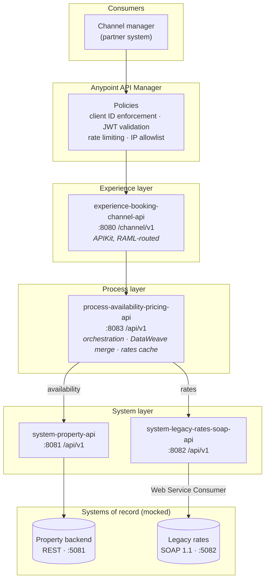
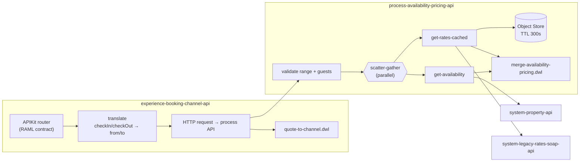

# Architecture

## API-led connectivity layers



## Why each layer exists

| Layer | Owns | Never does |
|---|---|---|
| **Experience** | One consumer's vocabulary: `checkIn`/`checkOut`, a flat `price` per night, paging. | Talk to a backend, or hold a business rule another channel would also need. |
| **Process** | The business rule that turns two calendars into one quotable stay: the date join, the occupancy surcharge, currency conversion, tax. | Know a backend hostname, or format anything for a particular consumer. |
| **System** | One system of record each. Absorbs its dialect — minor-unit amounts, nested addresses, SOAP envelopes. | Combine data from another system, or apply a business rule. |

The test of the layering is a substitution question: replacing the SOAP rates
engine with a REST one should change exactly one module
(`system-legacy-rates-soap-api`) and nothing above it. Adding a second consumer —
a mobile app, say — should add one experience API and change nothing below it.

## Component detail



## Cross-cutting concerns

**Correlation ID.** The HTTP listener adopts an inbound `X-Correlation-ID`, or
generates one. Every request config sets it as a default header, so a single id
spans all four applications and both backends, and it is returned in the response
body and headers. That is what makes a partner's "my request failed at 14:02"
answerable.

**Structured logging.** `log4j2.xml` uses `JsonTemplateLayout`, and every
`<logger>` emits a JSON object with an `event` key rather than an interpolated
sentence. Anypoint Monitoring, ELK and Splunk can all index that without a grok
pattern.

**Error contract.** Every layer returns the same envelope:

```json
{
  "error": {
    "code": "BACKEND_UNAVAILABLE",
    "message": "The property backend did not respond in time. Retry with backoff.",
    "layer": "system-property-api",
    "correlationId": "8f1c0b2e-0d1a-4f2b-9d55-2f6a1f0c9e77",
    "timestamp": "2026-05-14T09:12:33.412+02:00"
  }
}
```

The experience layer flattens it to the partner-facing `Error` type (no `layer`
field — a partner should not learn our internal topology from an error).

**Retry.** System APIs wrap backend calls in nested `until-successful` scopes;
see [troubleshooting.md](troubleshooting.md#retry-and-backoff) for why the shape
is what it is and what Mule does not give you out of the box.

**Caching.** Rate calendars are cached in an Object Store for 300s.
Availability is never cached: a stale "yes" oversells a night, and that costs
more than an extra backend call.
