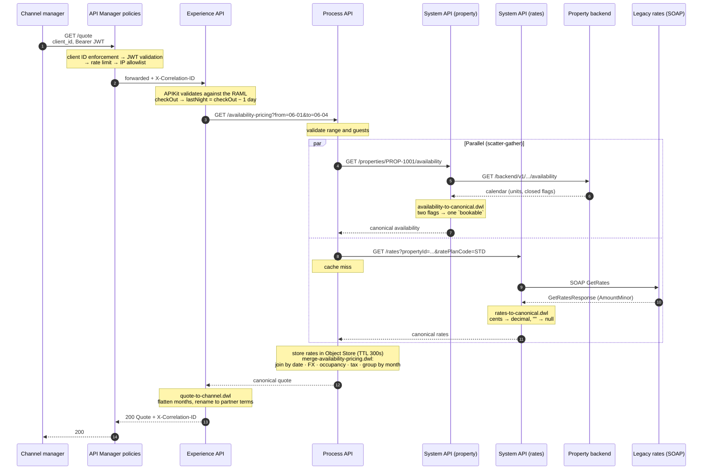
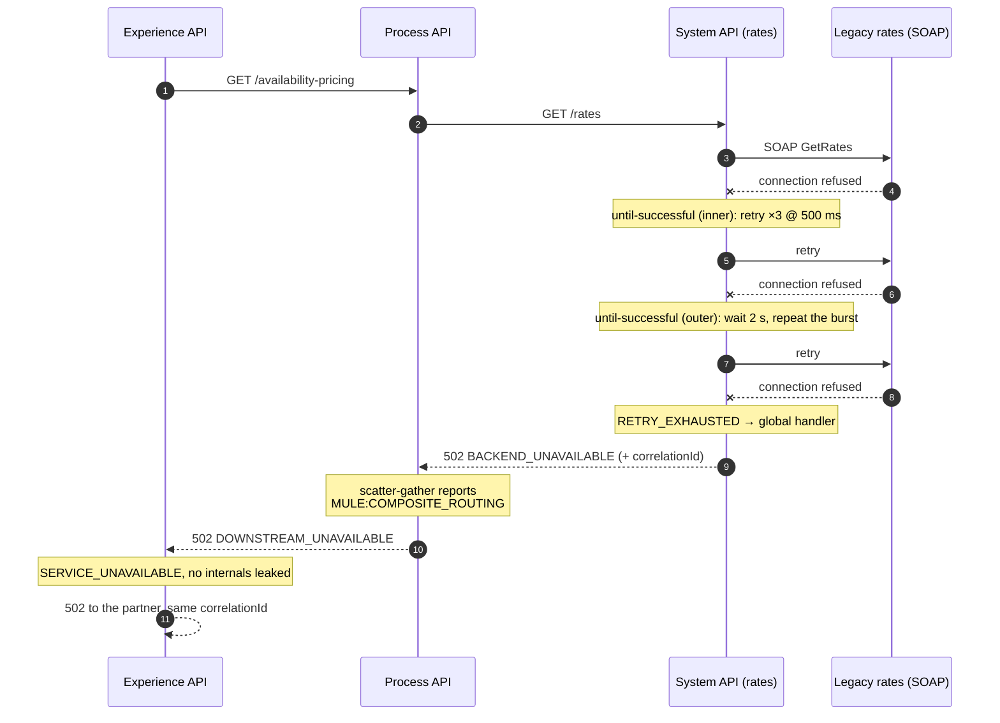

# Request walkthrough

One request, end to end:

```
GET /channel/v1/properties/PROP-1001/quote?checkIn=2026-06-01&checkOut=2026-06-05&guests=2&currency=EUR
```

## Happy path



The two system calls run in parallel, so worst-case latency is
`max(property, rates)` rather than their sum. On a cache hit the rates branch
returns without leaving the process API at all.

## Failure path: the rates backend is down



Two decisions are worth calling out, because both are the kind of thing that goes
wrong silently:

- **A 404 is not a retry.** The property system API adds `404` to the request
  validator's success codes so an unknown property never burns four retries and
  four seconds before returning the answer it already had.
- **A partial merge is a wrong answer, not a partial one.** If the rates branch
  fails, the process API returns 502 rather than a quote with missing prices.
  A channel manager that receives a price sells at that price.

## Failure path: a night has no rate

Not an error. The merge marks the night `priced: false`, lists it under
`gaps.unpricedDates`, and sets `quotable: false`. The partner gets a 200 with an
explicit reason it cannot sell the stay, which is far more useful than a 502 —
and it is covered by
`merge-separates-unpriced-nights-from-unavailable-ones` in the MUnit suite.
